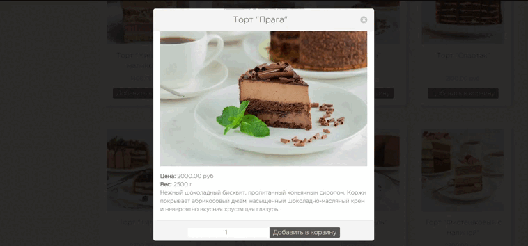
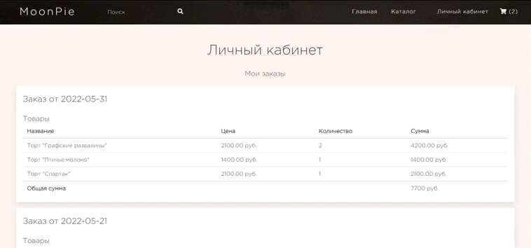
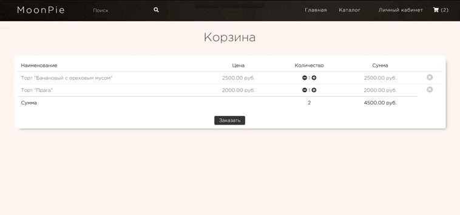

<h1 align="center"> MoonPie </h1>
<p align="center">This project is a prototype of an online confectionery store. The site has a catalog (search, filter), cart and personal account. </p>
<div align="center">
 


</div>
<h3 align="center">Main Page</h3>
<div id="header" align="center">
  
</div>
<br>
<hr>

<h3 align="center">Catalog</h3>
<div id="header" align="center">
  
</div>
<br>
<div id="header" align="center">
  
</div>
<br>
<hr>
<h3 align="center">Personal page</h3>
<div id="header" align="center">
  
</div>
<br>
<hr>
<h3 align="center">Cart</h3>
<div id="header" align="center">
  
</div>

## Project setup
```
npm install
```

### Compiles and hot-reloads for development
```
npm run serve
```

### Compiles and minifies for production
```
npm run build
```

### Customize configuration
See [Configuration Reference](https://cli.vuejs.org/config/).
